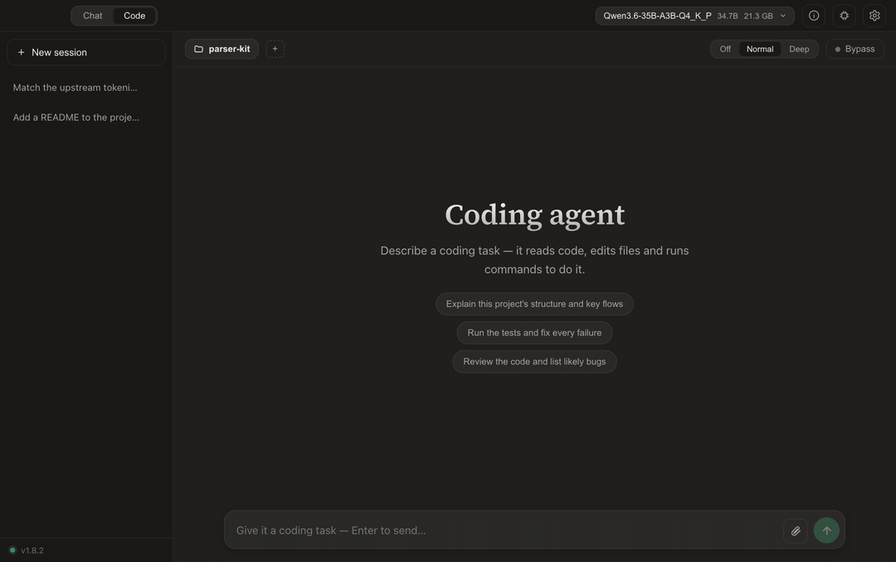
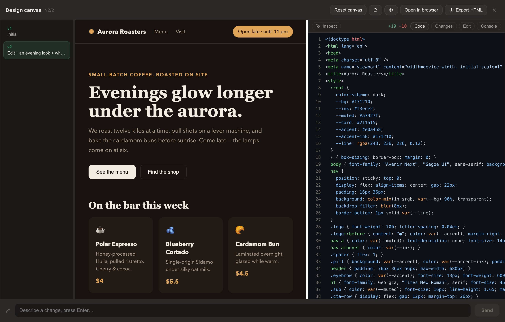
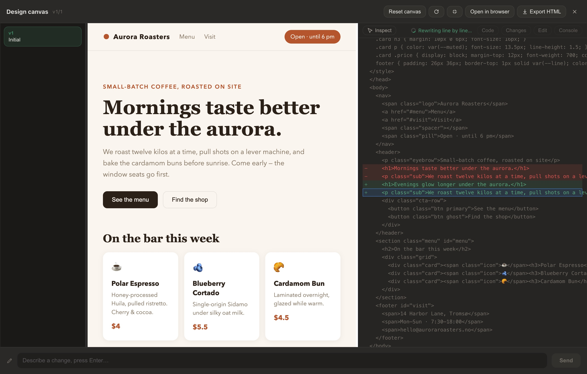

<div align="center">

[English](README.md) · [简体中文](README.zh-CN.md) · **Português (BR)**


# Chaty

### IA privada, no seu dispositivo — seus modelos, seus dados, sua máquina.

O Chaty roda LLMs abertos **100% offline** em um aplicativo desktop caprichado.
Sem conta, sem nuvem, sem telemetria — com um agente de programação local, uma base de
conhecimento para documentos, Deep Research e voz mãos-livres, tudo integrado.

**Novidade — o [Muse-Glimmer](https://huggingface.co/meta-models/Muse-Glimmer-30B) roda nos
dois motores, visão inclusive, com seus quatro degraus nativos de raciocínio como controles
de verdade.**
[Como o Chaty se adaptou a ele ↓](#esforço-de-raciocínio-como-controle-de-primeira-classe)

[](../../releases/latest)
[](../../releases)
[](../../actions)
[](../../releases)
[](../../releases)
[](#esforço-de-raciocínio-como-controle-de-primeira-classe)
[](#esforço-de-raciocínio-como-controle-de-primeira-classe)
[](https://chaty.ca)
[](#arquitetura)
[](LICENSE)

[**↓ Baixar**](../../releases) · [**Site**](https://chaty.ca) · [**Docs**](https://chaty.ca/docs.html) · [**Modelo do Chaty no Hugging Face**](https://huggingface.co/stevenpr/chaty-qwen3.5-4b-design-GGUF)

<br />



<sub>Um agente de programação local — pesquisa no GitHub, lê o código-fonte, edita seus arquivos e roda os testes. **Tudo na sua máquina.**</sub>

</div>

---

## Por que o Chaty

- 🔒 **Privado de verdade** — cada modelo, documento e conversa fica no seu dispositivo. Sem cadastro, sem servidor, nada é enviado para fora.
- ⚡ **Nativo e rápido** — núcleo em Rust + llama.cpp com offload de GPU **Vulkan / Metal**, autoajustado ao seu hardware e com fallback suave para CPU.
- 🧰 **Muito além de um chat** — um agente de programação, uma base de conhecimento (RAG), Deep Research, voz mãos-livres e um Design Canvas autocorretivo — tudo offline.
- 🧠 **Roda quase tudo** — Llama 3 / **Muse-Glimmer**, Gemma 3 / 4, Qwen 3 / 3.5 / 3.6 / **3.8**, *qualquer* GGUF do Hugging Face — e **modelos MLX nativamente em Apple Silicon** — além do **modelo fine-tuned do próprio Chaty**.
- 💻 **Amigável com hardware modesto** — no primeiro uso, o *"Configure para mim"* escolhe um modelo do tamanho da sua RAM e baixa tudo em um clique.

<br />

## Esforço de raciocínio como controle de primeira classe

Alguns modelos trazem uma **escada nativa de esforço de raciocínio** que foram treinados para
obedecer — o [Qwen3.8](https://huggingface.co/Qwen/Qwen3.8-27B) tem três degraus (`low` ·
`medium` · `xhigh`), o [Muse-Glimmer](https://huggingface.co/meta-models/Muse-Glimmer-30B)
tem quatro (`low` · `medium` · `high` · `xhigh`). O degrau chega como um kwarg do chat
template, então um runtime que a desconhece recebe o padrão em silêncio: você espera o
raciocínio mais longo possível até para "quanto é 2 + 2".

O Chaty trata a escada como um controle que você realmente gira:

<table>
<tr><td width="52%">

- **Chat** — o item de raciocínio no menu `+` abre um submenu com os degraus *do próprio
  modelo*; escolha um e ele vale para a próxima mensagem.
- **Code** — o seletor Desligado / Normal / Profundo vira a escada do próprio modelo, com
  quantos degraus ele tiver, para que um passo do agente pense pouco e siga em frente.
  `Desligado` continua sendo do Chaty: uma escada não tem degrau para não pensar.
- **Nos dois motores, com honestidade.** No MLX o degrau segue como kwarg do template. O
  llama.cpp não aceita kwargs próprios — então o Chaty reescreve o prompt renderizado para o
  degrau pedido, com resultado **idêntico byte a byte** ao que o template oficial produz.
- **Detectado pelo template, nunca pelo nome do modelo** — um fine-tune renomeado ou
  re-quantizado mantém sua escada, e todo modelo *sem* escada mantém o mesmo botão liga/desliga
  de sempre.

</td><td width="48%">

Mesma pergunta, mesma seed, um degrau de diferença — Qwen3.8-27B (MLX 8-bit, Apple Silicon 48 GB):

| degrau | raciocínio | tokens | tempo |
|---|---|---|---|
| `low` | 725 caracteres | 158 | **24 s** |
| `medium` | 879 caracteres | 226 | 31 s |
| `xhigh` *(padrão do modelo)* | 4 661 caracteres | 936 | 125 s |

Cinco vezes a espera, ou cinco vezes a deliberação — você decide, a cada mensagem.

</td></tr>
</table>

<br />

<br />

## Um agente de programação local

Alterne a chave **Chat · Código** e o Chaty vira um agente para o seu código. Aponte-o
para uma pasta, descreva a tarefa, e ele explora, edita e verifica o projeto por conta
própria — cada passo exibido ao vivo, cada mudança atrás de uma aprovação + diff.

- 🌐 **A web inteira como ferramenta** — busca sem chave de API no **GitHub** (repositórios, issues *e código*), Reddit, YouTube, Bilibili e qualquer domínio; o fetch se adapta ao conteúdo (artigos → Markdown, PDFs → texto, vídeos → transcrições).
- 🧭 **Dirige um navegador de verdade** — abre páginas, lê conteúdo dinâmico como texto, clica e preenche formulários inteiros com eventos reais de mouse, faz login e pagina — e *enxerga* com o modelo de visão quando importa.
- 🧠 **Ferramentas que pensam junto** — `understand_repo` se orienta em uma chamada, `search_code` ranqueia arquivos por relevância, `read_file` extrai um símbolo e seus pontos de uso, `validate_change` roda só os testes que a mudança toca. Modelos pequenos gastam seus passos em decisões, não em trabalho braçal.
- ✏️ **Edições precisas, shell de verdade** — patches por string exata atrás de um preview de diff com **verificação de sintaxe**, além de comandos e **jobs longos em segundo plano** (servidores dev, builds) confinados ao workspace.
- ⏪ **Você no controle** — aprovação por ação, lista de comandos permitidos, defesa contra prompt injection em tudo que ele lê, e **rebobinar por checkpoint em um clique**, restaurando arquivos *e* revertendo a conversa.
- 🔌 **MCP, no tamanho de modelos pequenos** — conecte qualquer servidor Model Context Protocol (stdio ou HTTP streamável), ou instale com um clique uma **entrada curada e com versão fixada da loja**, certificada ao vivo contra o próprio cliente do Chaty. A documentação das ferramentas é sintetizada enxuta para que um contexto de 16K comporte quantos servidores você quiser; todo resultado tem defesa contra injection e servidores não confiáveis exigem aprovação por chamada.
- 📚 **Skills e memória de projeto** — deixe um `SKILL.md` com passos procedurais em `~/.chaty/skills/` (ou por projeto) e o agente o carrega só quando relevante; `remember` grava descobertas não óbvias em `.chaty/memory/` para a próxima sessão já começar sabendo delas. Markdown puro, editável por humanos, nunca sai da máquina.

<details>
<summary>Mais detalhes do modo Código</summary>

- Lê **PDF / Word / Excel / PowerPoint** (um PDF escaneado não tem camada de texto e diz isso); `search_files` encontra por nome ou conteúdo; outlines de arquivo navegam arquivos grandes; patches que falham recebem dicas de "você quis dizer".
- A automação de navegador é verificada de ponta a ponta contra sites reais, e pode rodar no seu Chrome de verdade — assista-o trabalhar, logins e tudo.
- Feito para modelos locais: chave de raciocínio **Off / Normal / Deep**, um **anel de progresso do processamento do prompt**, um anel de uso de contexto com compactação automática, leituras de arquivo inteiro dimensionadas à sua janela de contexto, `search_code` ranqueado + `search_docs` da base de conhecimento, e quebra de loops para modelos pequenos repetitivos.
- Sessões persistentes, memória de projeto (**AGENTS.md**), **/skills** personalizadas e comandos de barra.
- Ajuste em **Configurações → Código**: limite de passos, timeout de comandos, temperatura por passo, aprovação automática de edições, navegador headless e lista de comandos permitidos.
- O acesso a arquivos nunca sai da pasta que você escolheu; acesso fora do workspace pede permissão por pasta; um comando `sudo` pergunta antes com um prompt de senha seguro; downloads caem no workspace e também são cobertos pelos checkpoints.

</details>

<br />

## Benchmarks

Um único modelo local em todas as linhas — **Qwen3.5-35B-A3B** (MoE, ~3 B ativos por token), mxfp8 em MLX, raciocínio desligado, tudo em uma máquina:

| SWE-bench Verified — subconjunto de 45 tarefas validado em macOS | Resolvidas |
| --- | --- |
| **Agente do Chaty (v1.9)** — o loop completo de ferramentas, contexto de 16K | **15/45 (33 %)** |
| qwen-code 0.20 — a CLI da própria família do modelo (exige 32K) | 12/45 (27 %) |
| pi 0.81 — CLI de agente minimalista com 4 ferramentas | 10/45 (22 %) |
| opencode 1.18 | 7/45 (16 %) |
| agente bash puro — ablação de ferramenta única | 6/45 (13 %) |

Mesmo modelo, mesmas tarefas, mesma correção, uma máquina — cinco designs de agente. O Chaty lidera o campo, incluindo a CLI oficial da família do modelo ([qwen-code](https://github.com/QwenLM/qwen-code)) usando **metade da janela de contexto**, e resolve **2,5×** a ablação bash pura. É a tese de design medida: com modelos de fronteira um andaime fino basta — em modelos locais pequenos, a inteligência precisa morar nas ferramentas (busca ciente do repositório, leitura por símbolo, edições precisas, guardas de recuperação, diagnóstico pós-edição). Metodologia, configurações por agente e notas de comparação honesta (subconjunto, harness macOS — *não* comparável a números de leaderboard): [docs/BENCHMARKS.md](docs/BENCHMARKS.md).

<br />

## Design Canvas

<picture>
  <source media="(prefers-color-scheme: light)" srcset="docs/screenshots/canvas-hero-light.jpg" />
  
</picture>

- **Preview | código, lado a lado** — cada página abre como um estúdio dividido: preview ao vivo à esquerda, o **código-fonte real** à direita, com highlight de sintaxe seguindo a paleta. Três colunas redimensionáveis, tela cheia, recarregar página e uma aba **Console** para os logs e erros da página.
- **Aponte para o que você quer dizer** — o Inspecionar liga os painéis nos dois sentidos: passe o mouse num elemento e o código pula para a linha dele; clique numa linha de código e o elemento pisca. **Clique para selecionar** (multisseleção com ⌘/Ctrl) e sua próxima instrução edita exatamente esses elementos — ou abra o código você mesmo com o botão **Editar**.
- **Veja a edição acontecer** — as iterações chegam em streaming, estilo Cursor: o painel de código varre o documento linha a linha e termina num diff de **Mudanças** (+N/−N, na mesma linguagem do modo Código).

<picture>
  <source media="(prefers-color-scheme: light)" srcset="docs/screenshots/canvas-scan-light.jpg" />
  
</picture>

- **Autocorretivo, persistente** — erros de runtime oferecem um **Corrigir** de um clique (sempre pergunta antes); uma camada de compatibilidade mantém limpas aqui as páginas que são limpas no navegador (history API, cookies, clipboard); e cada resposta mantém sua sessão de canvas entre fechar/reabrir, com histórico de versões, reset confirmado e exportação para um `.html` independente.

<br />

## Um chat que renderiza tudo

<table>
<tr>
<td width="50%"></td>
<td width="50%"></td>
</tr>
</table>

- Um painel **`<think>`** dobrável e em streaming que acompanha o raciocínio do modelo enquanto ele gera.
- Matemática **KaTeX**, tabelas, diagramas **Mermaid**, copiar código por bloco e renderização in-app de HTML de arquivo único — incluindo jogos web jogáveis.
- Uma **paleta de comandos ⌘K**, conversas fixáveis / renomeáveis, anexos por arrastar e soltar, exportação (Markdown / JSON) e busca em texto completo.
- Quatro paletas (duas escuras, duas claras) com tema do sistema, zoom nativo da interface, suporte a redução de movimento e interface em **English / 简体中文 / Português (BR)**.

<br />

## O Chaty enxerga

Carregue um **modelo de visão** (os pesos e o encoder `mmproj` moram juntos numa pasta, pareados automaticamente) e o entendimento de imagens liga em todo lugar:

- **Chat** — anexe uma foto e pergunte sobre ela; as perguntas seguintes continuam rápidas (imagens já vistas não são recodificadas).
- **Código** — o agente lê capturas de tela e pode olhar qualquer imagem com `view_image`; o compositor aceita imagens e documentos como no chat.
- **Base de conhecimento** — imagens importadas ganham uma descrição escrita ao lado do texto de OCR, então a busca encontra o que está *dentro* delas; imagens embutidas **dentro** de PDFs, Word, Excel e PowerPoint também são extraídas e descritas.
- **Canvas** — o modelo vê a página renderizada ao vivo quando você pede uma edição.

Modelos só-texto mantêm o caminho de OCR, então nada regride — e ao atualizar de uma versão antiga, um aviso único organiza seus `.gguf` soltos no layout de uma-pasta-por-modelo com um clique.

<br />

## Modelos: a loja, MLX nativo — e o do próprio Chaty

- Uma **loja de modelos** embutida: busque no Hugging Face por nome ou autor, filtre **GGUF / MLX**, ordene por tendência ou downloads — então escolha uma **quantização** no dropdown e baixe. Modelos, não listas de arquivos.
- Badges de parâmetros / arquitetura / visão, o README do repositório renderizado no app, e uma dica de **"cabe inteiro na memória"** dimensionada à sua máquina. Modelos de visão baixam seu encoder automaticamente; colar o link de um repositório continua funcionando.
- **MLX roda nativamente** em Apple Silicon: modelos em pasta da mlx-community carregam pela stack MLX da Apple num sidecar isolado — mesmo chat, visão, controles de raciocínio, agente de Código e base de conhecimento do GGUF, e ejetar um modelo *sempre* devolve a memória.
- **O fine-tune do próprio Chaty** — um Qwen3.5-4B destilado de um professor muito maior para web design de arquivo único mais enxuto no dispositivo, com identidade Chaty embutida e citações fundamentadas. Escolha de um clique no *"Configure para mim"*, totalmente aberto no **[Hugging Face](https://huggingface.co/stevenpr/chaty-qwen3.5-4b-design-GGUF)**.

<br />

## Uma base de conhecimento privada

<table>
<tr>
<td width="52%">

- Indexe **PDF, Word, Excel, Markdown, ~90 formatos de texto/código e imagens** num repositório local — um arquivo ou uma pasta inteira. Imagens são lidas por **OCR *e*, com um modelo de visão, descritas em palavras**, então você busca o que está *na* foto.
- **Recuperação híbrida**: vetores bge-m3 + palavras-chave BM25, fundidos com RRF, deduplicados com MMR, expandidos com vizinhos.
- **Fundamentação estrita** — as respostas vêm só dos seus arquivos, com **citações por arquivo** e preview do trecho-fonte ao passar o mouse. O Chaty avisa quando algo não está coberto, em vez de chutar.
- **Relatório em um clique** — um panorama citado, estilo NotebookLM, da base inteira, exportável para PDF ou Markdown.

</td>
<td width="48%"></td>
</tr>
</table>

<br />

## Deep Research e a web

- Dê um tema e o Chaty planeja consultas, roda **múltiplas rodadas** de busca na web intercaladas com raciocínio, e escreve um relatório estruturado e citado — **exportável para PDF ou Markdown**.
- Honesto por design: a lista de referências contém apenas fontes realmente citadas.
- Uma cadeia de busca gratuita, sem chave e multiprovedor (Brave → Bing → DuckDuckGo → Wikipedia), para que um provedor bloqueado nunca quebre a busca.

<br />

## Voz mãos-livres

<table>
<tr>
<td width="48%"></td>
<td width="52%">

- **Modo ao vivo** — conversa contínua e mãos-livres com um orbe animado.
- Voz de entrada/saída com envio automático por silêncio e leitura em voz alta — **11 vozes** com controle de velocidade.
- **Inglês ou chinês** — o reconhecimento e uma voz chinesa entram junto com o idioma da interface, ou por Configurações → Voz. O inglês continua no modelo somente-inglês, mais preciso em inglês.
- **Podcast aprofundado** — transforme sua base de conhecimento num programa de áudio com dois apresentadores, estilo NotebookLM, com exportação WAV.
- Toda a voz roda na **CPU**, então nunca disputa VRAM com o LLM.

</td>
</tr>
</table>

<br />

## Tudo fica na sua máquina

<table>
<tr>
<td width="52%">

- Conversas, modelos e índices moram numa única **pasta de dados local** — copie para fazer backup, limpe com um clique.
- **Aceleração de GPU**: **Vulkan** multi-fabricante (Windows) e **Metal** (Apple Silicon, offload total em memória unificada), autoajuste ciente de VRAM com recuo em OOM e fallback para CPU.
- **Qualquer `.gguf` — ou pasta MLX** — tokenizer e template de chat vêm do próprio modelo; tratamento de primeira classe para Llama 3 e Muse-Glimmer (visão, e seu protocolo de raciocínio ATEM), Gemma 3 / 4 e Qwen 3 / 3.5 / 3.6 / 3.8 (incluindo suas escadas de esforço de raciocínio).
- **Contexto ajustável** que adapta o comprimento treinado do modelo à sua memória e resume turnos antigos perto do limite; **troca segura de modelo** e controles completos de amostragem com presets salváveis.

</td>
<td width="48%"></td>
</tr>
</table>

> **Offline em primeiro lugar.** A rede só é usada para busca web opcional e downloads únicos de modelos.

<br />

## Instalar

Baixe a build mais recente na página de [**Releases**](../../releases):

| Plataforma | Arquivo | Notas |
|---|---|---|
| Windows x64 | `Chaty_*_x64-setup.exe` | Instalador por usuário — não requer admin |
| macOS (Apple Silicon) | `Chaty_*_aarch64.dmg` | Veja a nota de primeiro uso abaixo |

**Primeiro uso no macOS.** O Chaty é assinado ad-hoc mas não notarizado (não há uma conta
paga de Apple Developer por trás), então o Gatekeeper avisa na primeira abertura. O app é
seguro — tudo roda localmente. Limpe a quarentena do download uma vez:

```sh
xattr -dr com.apple.quarantine /Applications/Chaty.app
```

e abra o Chaty normalmente. (Ou: abra, dispense o aviso, e escolha **Ajustes do Sistema →
Privacidade e Segurança → Abrir Mesmo Assim**.) No macOS a pasta gravável de modelos fica
nos dados do app — use **Abrir pasta de modelos** no menu de modelos.

## Compilar

Detalhes completos em **[BUILD.md](BUILD.md)**.

```powershell
# Windows
npm install
.\dev.ps1                            # dev
npm run tauri build -- --no-bundle   # exe de release → compile o instalador Inno
```

```bash
# macOS (Apple Silicon)
npm install
npm run tauri dev      # dev (Metal)
npm run tauri build    # → .app + .dmg
```

As releases são produzidas por CI: atualize a versão com `scripts/bump-version.sh x.y.z`,
depois faça push de uma tag `vx.y.z` — o GitHub Actions compila os dois instaladores numa
única release.

## Arquitetura

| Camada | Stack |
|---|---|
| Shell | Tauri 2 — bandeja do sistema, atalho global, instância única |
| Frontend | React 19 · Vite · react-markdown · KaTeX |
| Inferência | Rust · `llama-cpp-2` (llama.cpp) — Vulkan (Windows) / Metal (macOS) · MLX via sidecar `mlx-swift-lm` (Apple Silicon) |
| Voz | `sherpa-rs` (ONNX Runtime, CPU) — Whisper (`base.en` para inglês, `base` multilíngue para chinês) + Kokoro-82M e uma voz chinesa VITS |
| Base de conhecimento | embeddings bge-m3 + BM25 · recuperação híbrida RRF / MMR · vetores em SQLite |
| Armazenamento | SQLite — conversas, mensagens, busca em texto completo |

## Licença

MIT — veja [LICENSE](LICENSE). Construído com [llama.cpp](https://github.com/ggml-org/llama.cpp), [Tauri](https://tauri.app) e [sherpa-onnx](https://github.com/k2-fsa/sherpa-onnx).
