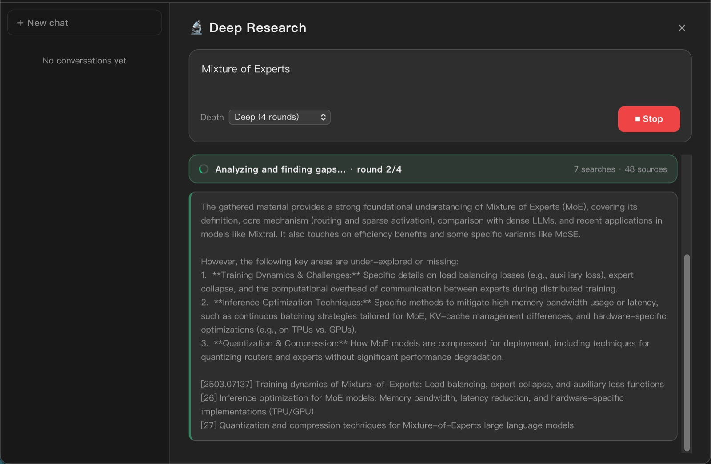
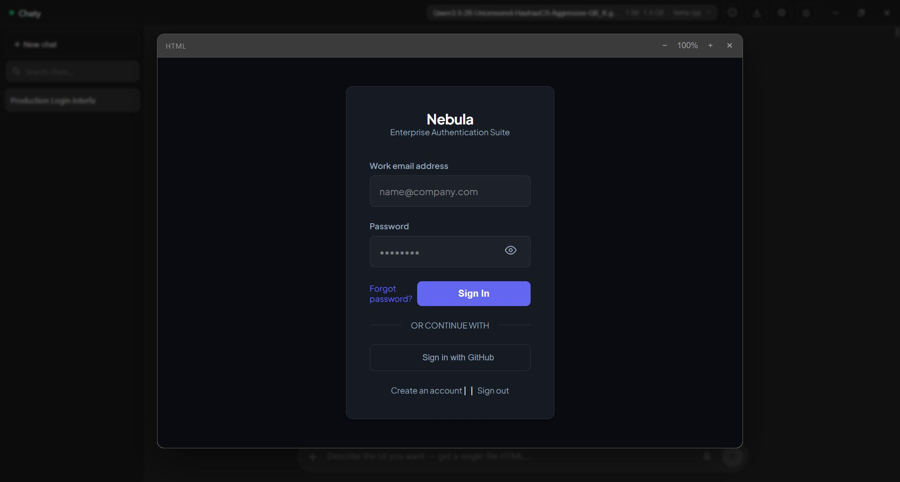

<div align="center">

[English](README.md) · **简体中文**


# Chaty

### 私密的本地 AI —— 你的模型、你的数据、你自己的设备。

Chaty 是一款精致的桌面应用,让开源大模型**完全离线**运行。
无需账号、不上云、零遥测 —— 还内置文档知识库、多轮 Deep Research 与免手语音。

[](../../releases)
[](../../releases)
[](https://chaty.ca)
[](#架构)
[](LICENSE)

[**↓ 下载**](../../releases) · [**官网**](https://chaty.ca) · [**Hugging Face 上的 Chaty 模型**](https://huggingface.co/stevenpr/chaty-qwen3.5-4b-design-GGUF)

</div>

---

## 为什么选 Chaty

- 🔒 **真正私密** —— 每个模型、文档、对话都留在你的设备上。无需注册、没有服务器、不向任何地方回传。
- ⚡ **原生而快** —— Rust + llama.cpp 推理内核,**Vulkan / Metal** GPU 卸载,按硬件自动调优,放不下时平稳回退 CPU。
- 🧰 **不只是聊天框** —— 本地知识库(RAG)、智能体式 Deep Research、免手语音,以及会自愈的**设计画布** —— 全部离线。
- 🧠 **几乎什么都能跑** —— Llama 3、Gemma 3 / 4、Qwen 3 / 3.5 / 3.6,或 Hugging Face 上的*任意* GGUF —— 还有 **Chaty 自研微调模型**。
- 💻 **对弱硬件友好** —— 首次启动的「为我配置」会按你的内存挑一个合适的模型,一键下载。

## 截图

| | |
|---|---|
|  |  |
| **Deep Research** —— 多轮联网搜索 → 一份带引用的报告。 | **实时语音模式** —— 免手、连续对话。 |
|  |  |
| **HTML 预览** —— 在应用内渲染并运行单文件网页。 | **深读播客** —— 把文档变成双主持人音频节目。 |

## 能力

### 本地推理
- 运行任意 `.gguf` —— 分词器与对话模板都直接取自文件本身。
- **GPU 加速**:跨厂商 **Vulkan**(Windows)与 **Metal**(Apple Silicon,统一内存下全量卸载),按显存自动调优,带 OOM 回退与 CPU 兜底。
- 一流支持 **Llama 3**、**Gemma 3 / 4** 与 **Qwen 3 / 3.5 / 3.6** —— 含 Gemma 4 的通道格式与 Qwen 3.5+ 思考开关控制 —— 并对社区模型有稳健的模板回退。
- **可调上下文窗口**,自动适配模型训练长度到你的内存,接近上限时自动总结较早的对话。
- **安全切换模型**(先彻底释放上一个),从 `models/` 文件夹热插拔,完整采样控制 + 可保存预设。
- **一键配置模型** —— 按硬件推荐 + 应用内 Hugging Face 下载器,进度实时、可随时取消。

### Code 模式(编码智能体)
- 顶栏新增 **Chat | Code** 模块切换,让 Chaty 变身**本地编码智能体**:选一个文件夹、描述任务,它就会自主探索、修改并验证项目 —— 文件读写、精确文本编辑、glob/grep 搜索、shell 命令(dev server / 长构建可**后台运行**,结束自动回报)、遇到陌生报错还能**联网查证**,每一步实时可见。
- **受限且带沙箱** —— 文件访问永远不出你选的工作区;macOS 上 shell 命令跑在 Seatbelt 沙箱里,只能写工作区内部。
- **一切由你掌控** —— 改动逐条审批并带真实 diff 预览、「总是允许」+ 命令白名单、**检查点一键回滚**(文件恢复、对话回退),任务计划清单实时更新,遇到该你拍板的事会弹选择题问你。
- **为本地模型而生** —— 思考过程可见且强度可调,上下文用量环 + 自动压缩,整文件单次读取(按上下文窗口自动定预算),`search_code` 语义检索 + `search_docs` 知识库联动,防复读循环打断;会话持久化、项目记忆(AGENTS.md)、自定义 `/技能`、slash 命令一应俱全。

### 知识库(RAG)
- 把 **PDF、Word(.docx)、Excel(.xlsx)、Markdown、约 90 种文本/代码/配置格式、图片**(含 OCR)索引进一个私有的本地库 —— 可逐个加文件,也可**整文件夹导入**(含子目录,保留项目结构)。
- **混合检索**:bge-m3 多语向量 + BM25 关键词,RRF 融合、MMR 去重、邻接分块扩展。
- **严格 grounding** —— 答案只来自你的文档;没覆盖到的内容 Chaty 会直说,而不是瞎猜。
- **按文件引用**,悬停预览出处段落,并支持按文档选择检索范围。
- **一键报告** —— 对整个知识库生成一份带引用的 NotebookLM 式综述(无需输入主题),可导出 PDF / Markdown,全程离线。

### Deep Research 与联网
- 给一个主题,Chaty 会规划查询、进行**多轮**联网搜索并穿插推理,最终写出结构化的带引用长报告 —— **可导出 PDF 或 Markdown**。
- 紧扣主题且诚实:参考文献只列它真正引用过的来源。
- 免费、免密钥的多provider搜索链(Brave → Bing → DuckDuckGo → Wikipedia),单个被封不会让搜索失效。

### 语音与音频
- 免手 **实时模式** —— 配一个动态光球的连续语音对话。
- 语音输入/输出,静音自动发送 + 朗读 —— **11 种嗓音** + 语速调节。
- **深读播客** —— 把知识库变成 NotebookLM 风格的双主持人音频节目,支持 WAV 导出。
- 所有语音都跑在 **CPU** 上,绝不与大模型抢显存。

### 设计画布
- **用聊天搭页面** —— 把 Chaty 生成的单文件 HTML 在分栏工作室里打开:一边实时预览,一边输入修改要求。用自然语言提需求,Chaty 会**原地修改**页面(快速的查找/替换补丁,而非整页重生成)。
- **自愈修复** —— 预览会监测运行时错误,出错时给出一键**修复**,把错误交给模型处理;每次修复都先征求同意,不会失控循环。
- **版本历史**可回退,并可导出为独立 `.html` 或在浏览器中打开。与 Chaty 自有的网页设计微调模型天然契合。

### 精心打磨的聊天体验
- 流式、可折叠的 `<think>` 面板,随生成自动跟随推理。
- KaTeX 数学公式、表格、**Mermaid** 图、逐块代码复制,以及在设计画布中渲染单文件网页(含可玩的网页游戏)。
- **⌘K 命令面板**、可置顶/重命名的对话、应用内确认弹窗,以及防崩溃的错误边界 —— 意外错误也不会让窗口白屏。
- 拖拽附件、对话导出(Markdown / JSON)、全文搜索、分支历史、四套配色方案(深浅各两款,可跟随系统)、四种代码高亮样式、原生界面缩放、**减少动态效果**支持、系统托盘、全局快捷键,以及 **English / 简体中文** 界面。

> **离线优先。** 网络仅用于可选的联网搜索和一次性模型下载。

## Chaty 自研模型

除了第三方模型,Chaty 还自带**专属微调** —— 一个从更大的教师模型蒸馏而来的 Qwen3.5-4B,
为本地单文件网页设计调校,内置 Chaty 身份认同与带引用的回答。它是「为我配置」里的一键选项,
并在 **[Hugging Face](https://huggingface.co/stevenpr/chaty-qwen3.5-4b-design-GGUF)** 完全开源。

## 安装

到 [**Releases**](../../releases) 页面获取最新构建:

| 平台 | 文件 | 说明 |
|---|---|---|
| Windows x64 | `Chaty_*_x64-setup.exe` | 单用户安装,无需管理员权限 |
| macOS（Apple Silicon） | `Chaty_*_aarch64.dmg` | 见下方首次启动说明 |

**macOS 首次启动。** Chaty 是 ad-hoc 签名但未公证(背后没有付费的 Apple Developer 账号),
所以首次打开时 Gatekeeper 会报警。应用是安全的 —— 一切都在本地运行。清除一次下载隔离属性即可:

```sh
xattr -dr com.apple.quarantine /Applications/Chaty.app
```

然后正常打开 Chaty。(或:先打开、忽略警告,再到 **系统设置 → 隐私与安全性 → 仍要打开**。)
macOS 上可写的模型文件夹在应用数据目录里 —— 用模型菜单里的 **打开模型文件夹**。

## 构建

详见 **[BUILD.md](BUILD.md)**。

```powershell
# Windows
npm install
.\dev.ps1                            # 开发
npm run tauri build -- --no-bundle   # 生成 exe → 再编译 Inno 安装包
```

```bash
# macOS（Apple Silicon）
npm install
npm run tauri dev      # 开发(Metal)
npm run tauri build    # → .app + .dmg
```

发布由 CI 完成:用 `scripts/bump-version.sh x.y.z` 升版本,推一个 `vx.y.z` tag —— GitHub Actions 会把两个平台的安装包打到同一个 release。

## 架构

| 层 | 技术栈 |
|---|---|
| 外壳 | Tauri 2 —— 系统托盘、全局快捷键、单实例 |
| 前端 | React 19 · Vite · react-markdown · KaTeX |
| 推理 | Rust · `llama-cpp-2`(llama.cpp)—— Vulkan(Windows)/ Metal(macOS) |
| 语音 | `sherpa-rs`(ONNX Runtime,CPU)—— Whisper-base.en + Kokoro-82M |
| 知识库 | bge-m3 向量 + BM25 · 混合 RRF / MMR 检索 · SQLite 向量库 |
| 存储 | SQLite —— 会话、消息、全文搜索 |

## 许可证

MIT —— 见 [LICENSE](LICENSE)。基于 [llama.cpp](https://github.com/ggml-org/llama.cpp)、[Tauri](https://tauri.app) 与 [sherpa-onnx](https://github.com/k2-fsa/sherpa-onnx) 构建。
