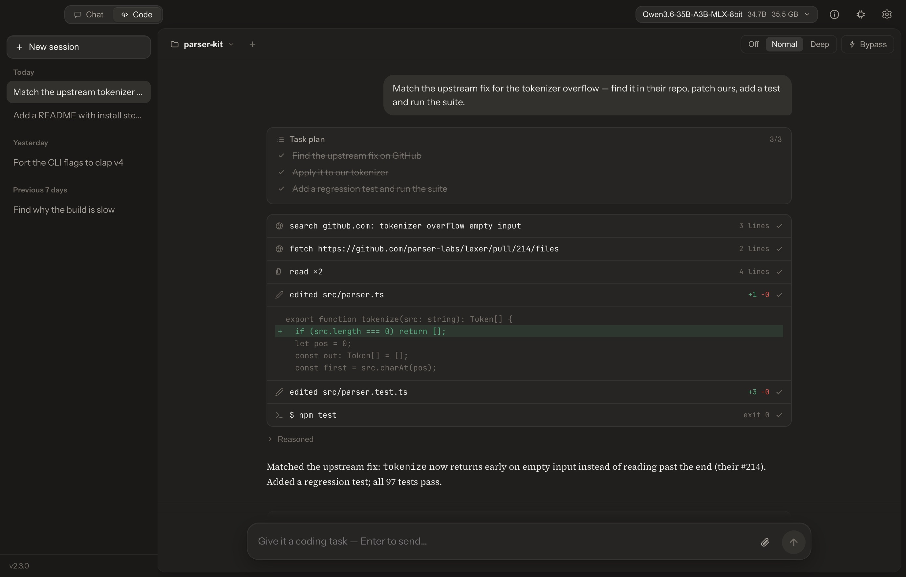
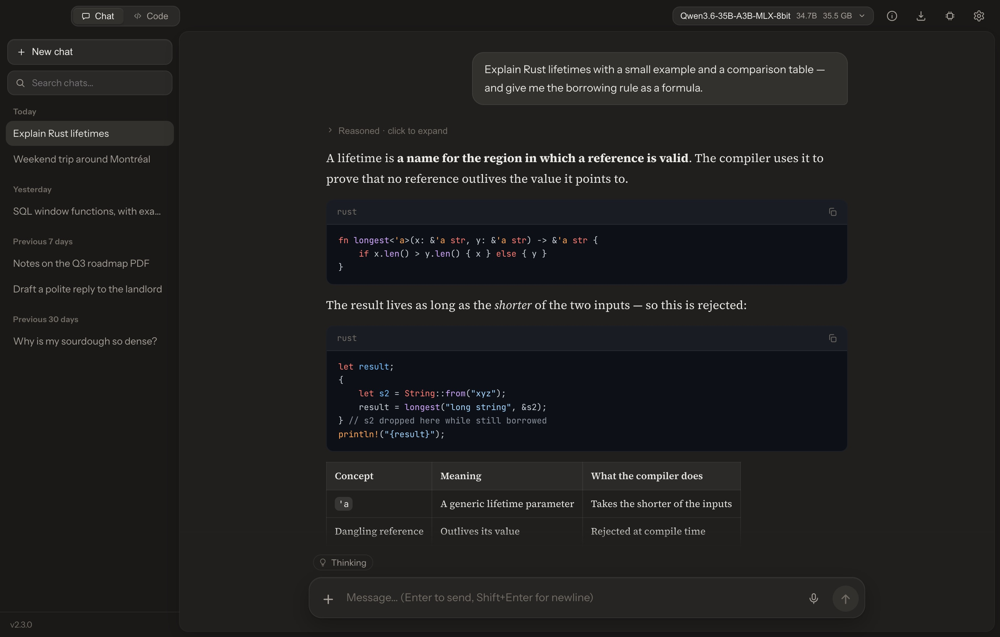
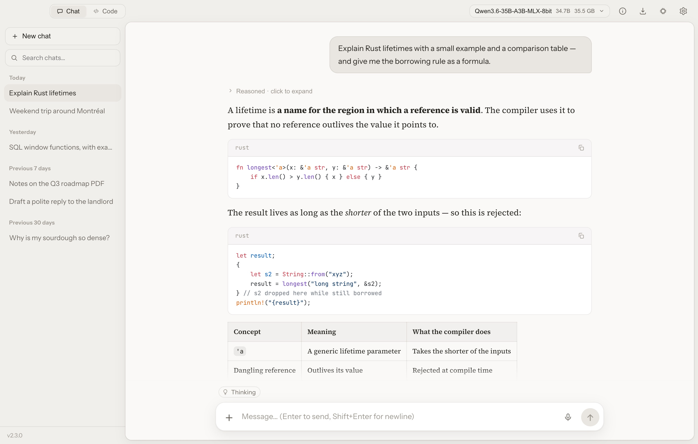
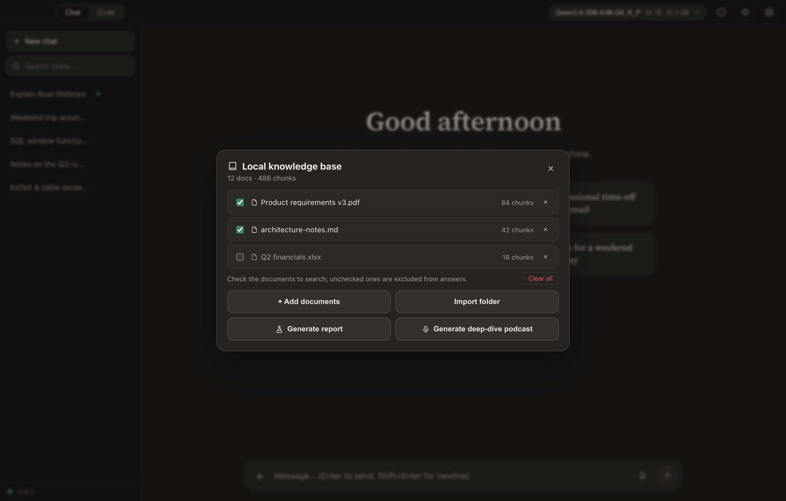
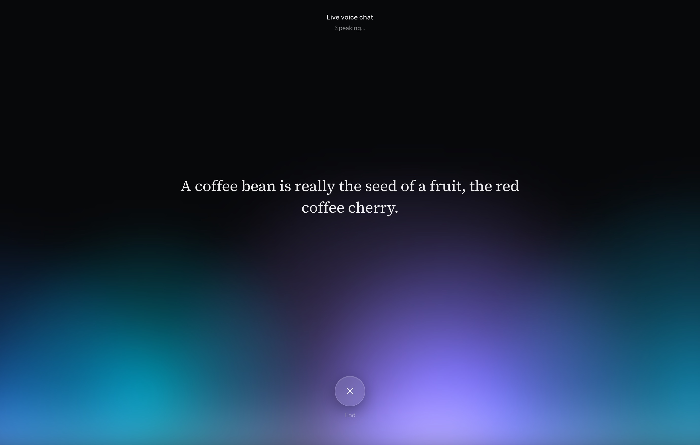
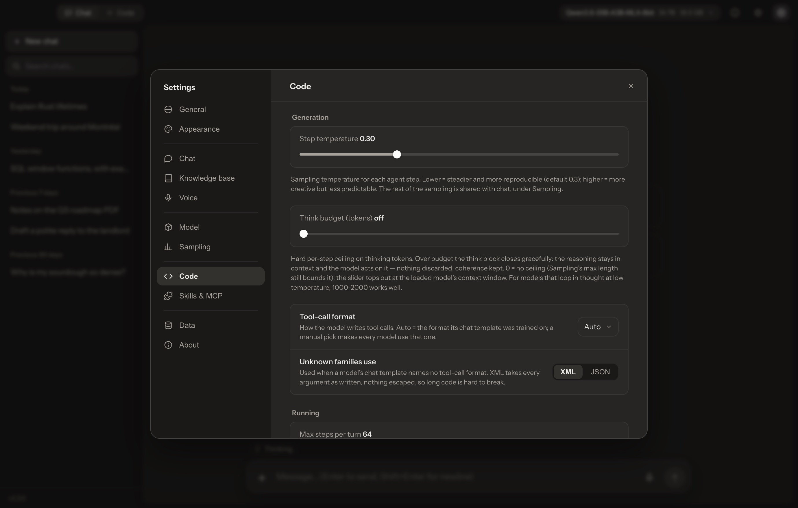

<div align="center">

[English](README.md) · **简体中文**


# Chaty

### 私密的本地 AI —— 你的模型、你的数据、你自己的设备。

Chaty 是一款精致的桌面应用,让开源大模型**完全离线**运行。
无需账号、不上云、零遥测 —— 还内置本地编码智能体、文档知识库、
Deep Research 与免手语音。

[](../../releases)
[](../../releases)
[](https://chaty.ca)
[](#架构)
[](LICENSE)

[**↓ 下载**](../../releases) · [**官网**](https://chaty.ca) · [**Hugging Face 上的 Chaty 模型**](https://huggingface.co/stevenpr/chaty-qwen3.5-4b-design-GGUF)

<br />



<sub>一个本地编码智能体 —— 搜 GitHub、读源码、改你的文件、跑测试。**全在你自己的机器上。**</sub>

</div>

---

## 为什么选 Chaty

- 🔒 **真正私密** —— 每个模型、文档、对话都留在你的设备上。无需注册、没有服务器、不向任何地方回传。
- ⚡ **原生而快** —— Rust + llama.cpp 内核,**Vulkan / Metal** GPU 卸载,按硬件自动调优,放不下时平稳回退 CPU。
- 🧰 **不只是聊天框** —— 编码智能体、知识库(RAG)、Deep Research、免手语音,以及会自愈的设计画布 —— 全部离线。
- 🧠 **几乎什么都能跑** —— Llama 3、Gemma 3 / 4、Qwen 3 / 3.5 / 3.6,或 Hugging Face 上的*任意* GGUF —— 还有 **Chaty 自研微调模型**。
- 💻 **对弱硬件友好** —— 首次启动的「为我配置」会按你的内存挑一个合适的模型,一键下载。

<br />

## 一个本地编码智能体

拨动 **Chat · Code** 开关,Chaty 就成了你代码库的智能体。选一个文件夹、描述任务,
它便自主探索、修改并验证项目 —— 每一步实时可见,每处改动都先审批 + 看 diff。

- 🌐 **整个互联网都是它的工具** —— 无 key 站内搜索 **GitHub**(仓库、issue、*代码*)、Reddit、YouTube、B站及任意域名;抓取按内容自适应(文章→Markdown、GitHub 页→raw 源码、PDF→文本、视频→字幕转写)。
- 🧭 **能开真实浏览器** —— 打开网页、把页面当文字读(含动态内容)、用真实鼠标事件点准元素、一次填完整张表单和下拉、登录、翻页,该用视觉时才截图亲眼看 —— 在真实网站上端到端验证过。就在一个真实 Chrome 里,你能全程围观,登录状态也保留。
- ✏️ **精确编辑** —— 带 diff 预览与「你是不是想改这里」提示的精确文本补丁、导航大文件的 outline 大纲,以及按名字或内容查找的 `search_files`。
- 🖥️ **真 shell** —— 运行命令与长时**后台任务**(dev server、构建),沙箱限定在工作区内(macOS 用 Seatbelt);sudo 命令会先询问,并有安全的密码输入框。
- ⏪ **一切由你掌控** —— 逐条审批、命令白名单、工作区外访问按目录询问、对读到的一切内容做防注入,以及**检查点一键回滚**:恢复文件*并*回退对话。

<details>
<summary>更多 Code 模式细节</summary>

- 为本地模型而生:**Off / Normal / Deep** 思考强度开关、**提示词处理进度环**、上下文用量环 + 自动压缩、按上下文窗口定预算的整文件读取、`search_code` 语义检索 + 知识库 `search_docs`,以及防复读循环打断。
- 会话持久化、项目记忆(**AGENTS.md**)、自定义 **/技能** 与 slash 命令。
- 在**设置 → Code** 里调:单轮步数上限、命令超时、步骤温度、自动批准编辑开关、后台运行浏览器开关,以及命令白名单。
- 文件访问永远不出你选的文件夹;下载落进工作区,也一并纳入检查点回滚。

</details>

<br />

## 什么都能渲染的聊天

<table>
<tr>
<td width="50%"></td>
<td width="50%"></td>
</tr>
</table>

- 流式、可折叠的 **`<think>`** 面板,随生成自动跟随模型推理。
- **KaTeX** 数学、表格、**Mermaid** 图、逐块代码复制,以及应用内渲染单文件 HTML —— 含可玩的网页游戏。
- **⌘K 命令面板**、可置顶/重命名的对话、拖拽附件、导出(Markdown / JSON)与全文搜索。
- 四套配色(深浅各两款,可跟随系统)、原生界面缩放、减少动态效果支持,以及 **English / 简体中文** 界面。

<br />

## Chaty 能看见

加载一个**视觉模型**(权重与 `mmproj` 编码器放在同一个文件夹里,自动配对),识图能力就会在各处打开:

- **聊天** —— 附一张图直接问;追问也很快(看过的图不再重复编码)。
- **Code** —— 智能体能读截图、用 `view_image` 看任意图片;输入框像聊天一样收图片和文档。
- **知识库** —— 导入的图片除 OCR 外还会生成一段文字描述,让你能搜到图里*画的是什么*。
- **画布** —— 让它改页面时,模型能看到当前渲染出的实际效果。

纯文本模型继续走 OCR,不影响任何原有功能 —— 而从旧版本升级时,一个一次性弹窗会引导你把散放的 `.gguf` 一键归入「一个模型一个文件夹」的布局。

<br />

## 一个私密的知识库

<table>
<tr>
<td width="52%">

- 把 **PDF、Word、Excel、Markdown、约 90 种文本/代码格式、图片**索引进本地库 —— 单文件或整文件夹。图片会走 **OCR**,配合视觉模型还会**用文字描述画面内容**,让你能搜到图里画的是什么。
- **混合检索**:bge-m3 向量 + BM25 关键词,RRF 融合、MMR 去重、邻接分块扩展。
- **严格 grounding** —— 答案只来自你的文档,**按文件引用**并悬停预览出处段落;没覆盖到的内容 Chaty 会直说,而不是瞎猜。
- **一键报告** —— 对整个知识库生成带引用的 NotebookLM 式综述,可导出 PDF / Markdown。

</td>
<td width="48%"></td>
</tr>
</table>

<br />

## Deep Research 与联网

- 给一个主题,Chaty 会规划查询、进行**多轮**联网搜索并穿插推理,最终写出结构化的带引用报告 —— **可导出 PDF 或 Markdown**。
- 天然诚实:参考文献只列它真正引用过的来源。
- 免费、免密钥的多 provider 搜索链(Brave → Bing → DuckDuckGo → Wikipedia),单个被封不会让搜索失效。

<br />

## 免手语音

<table>
<tr>
<td width="48%"></td>
<td width="52%">

- **实时模式** —— 配一个动态光球的连续、免手语音对话。
- 语音输入/输出,静音自动发送 + 朗读 —— **11 种嗓音** + 语速调节。
- **深读播客** —— 把知识库变成 NotebookLM 风格的双主持人音频节目,支持 WAV 导出。
- 所有语音都跑在 **CPU** 上,绝不与大模型抢显存。

</td>
</tr>
</table>

<br />

## 一切都留在你的机器上

<table>
<tr>
<td width="52%">

- 会话、模型、索引都在一个**本地数据文件夹**里 —— 拷走即备份,一键即清空。
- **GPU 加速**:跨厂商 **Vulkan**(Windows)与 **Metal**(Apple Silicon,统一内存下全量卸载),按显存自动调优,带 OOM 回退与 CPU 兜底。
- **任意 `.gguf`** —— 分词器与对话模板都取自文件本身;一流支持 Llama 3、Gemma 3 / 4 与 Qwen 3 / 3.5 / 3.6。
- **可调上下文**,自动把模型训练长度适配到你的内存,接近上限时总结较早的对话;**安全切换模型**,完整采样控制 + 可保存预设。

</td>
<td width="48%"></td>
</tr>
</table>

> **离线优先。** 网络仅用于可选的联网搜索和一次性模型下载。

<br />

## 设计画布

- **用聊天搭页面** —— 把 Chaty 生成的单文件 HTML 在分栏工作室里打开:一边实时预览,一边输入修改要求。用自然语言提需求,Chaty 会**原地修改**页面(快速的查找/替换补丁,而非整页重生成)。
- **自愈修复** —— 预览会监测运行时错误,出错时给出一键**修复**;每次修复都先征求同意,不会失控循环。配合视觉模型,改动时 Chaty 还会*看到*渲染出的页面(实时截图 + 控制台)。
- **版本历史**可回退,并可导出为独立 `.html`。与 Chaty 自有的网页设计微调模型天然契合。

<br />

## Chaty 自研模型

除了第三方模型,Chaty 还自带**专属微调** —— 一个从更大的教师模型蒸馏而来的 Qwen3.5-4B,
为本地单文件网页设计调校,内置 Chaty 身份认同与带引用的回答。它是「为我配置」里的一键选项,
并在 **[Hugging Face](https://huggingface.co/stevenpr/chaty-qwen3.5-4b-design-GGUF)** 完全开源。

<br />

## 安装

到 [**Releases**](../../releases) 页面获取最新构建:

| 平台 | 文件 | 说明 |
|---|---|---|
| Windows x64 | `Chaty_*_x64-setup.exe` | 单用户安装,无需管理员权限 |
| macOS（Apple Silicon） | `Chaty_*_aarch64.dmg` | 见下方首次启动说明 |

**macOS 首次启动。** Chaty 是 ad-hoc 签名但未公证(背后没有付费的 Apple Developer 账号),
所以首次打开时 Gatekeeper 会报警。应用是安全的 —— 一切都在本地运行。清除一次下载隔离属性即可:

```sh
xattr -dr com.apple.quarantine /Applications/Chaty.app
```

然后正常打开 Chaty。(或:先打开、忽略警告,再到 **系统设置 → 隐私与安全性 → 仍要打开**。)
macOS 上可写的模型文件夹在应用数据目录里 —— 用模型菜单里的 **打开模型文件夹**。

## 构建

详见 **[BUILD.md](BUILD.md)**。

```powershell
# Windows
npm install
.\dev.ps1                            # 开发
npm run tauri build -- --no-bundle   # 生成 exe → 再编译 Inno 安装包
```

```bash
# macOS（Apple Silicon）
npm install
npm run tauri dev      # 开发(Metal)
npm run tauri build    # → .app + .dmg
```

发布由 CI 完成:用 `scripts/bump-version.sh x.y.z` 升版本,推一个 `vx.y.z` tag —— GitHub Actions 会把两个平台的安装包打到同一个 release。

## 架构

| 层 | 技术栈 |
|---|---|
| 外壳 | Tauri 2 —— 系统托盘、全局快捷键、单实例 |
| 前端 | React 19 · Vite · react-markdown · KaTeX |
| 推理 | Rust · `llama-cpp-2`(llama.cpp)—— Vulkan(Windows)/ Metal(macOS) |
| 语音 | `sherpa-rs`(ONNX Runtime,CPU)—— Whisper-base.en + Kokoro-82M |
| 知识库 | bge-m3 向量 + BM25 · 混合 RRF / MMR 检索 · SQLite 向量库 |
| 存储 | SQLite —— 会话、消息、全文搜索 |

## 许可证

MIT —— 见 [LICENSE](LICENSE)。基于 [llama.cpp](https://github.com/ggml-org/llama.cpp)、[Tauri](https://tauri.app) 与 [sherpa-onnx](https://github.com/k2-fsa/sherpa-onnx) 构建。
