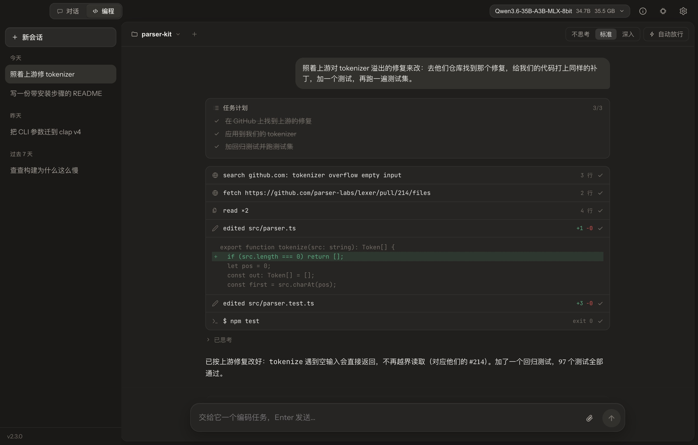
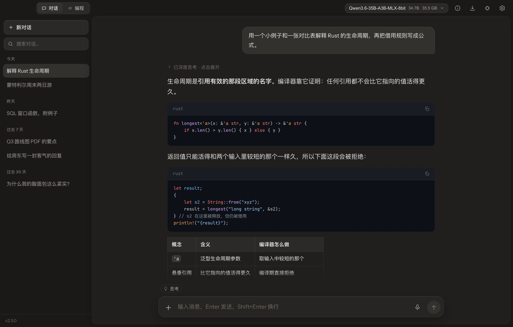
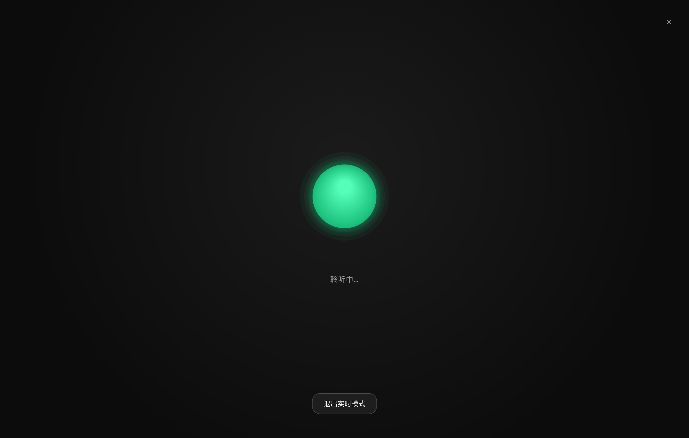

<div align="center">

[English](README.md) · **简体中文** · [Português (BR)](README.pt-BR.md)


# Chaty

**硬盘里的模型，真正干起活来。**

对话、编程智能体、文生图、从你自己的文档里找答案，还有能开口说话的语音——<br />
全部跑在你自己 Mac 或 PC 上的开源模型里。无需账号，不上云，零遥测。

[](../../releases/latest)
[](../../releases)
[](../../actions)
[](LICENSE)

[**下载**](../../releases/latest) · [**官网**](https://chaty.ca) · [**文档**](https://chaty.ca/docs.html) · [**更新日志**](CHANGELOG.md)

<sub>macOS（Apple Silicon）· Windows 10/11 · Linux（AppImage）—— GGUF 跑在 llama.cpp 上，Apple Silicon 原生跑 MLX，文生图跑在 stable-diffusion.cpp 上</sub>

<br />

<picture>
  <source media="(prefers-color-scheme: light)" srcset="docs/screenshots/shot-code-zh-light.jpg" />
  
</picture>

<sub>编程模式：智能体找到上游的修复，改了解析器，补上测试，跑完整套用例——用的是同一台笔记本上跑着的模型。</sub>

</div>

---

## 目录

[对话](#对话) · [编程](#编程) · [文生图](#文生图) · [文档与研究](#文档与研究) · [语音](#语音) · [为小模型而做](#专门对付小模型会犯的错) · [模型](#模型) · [隐私](#隐私) · [安装](#安装) · [构建](#构建) · [架构](#架构)

## 对话

看得见思路的对话。思考过程实时写进一个可以收起的面板；支持思考档位的模型——Qwen3.8 的 low · medium · xhigh、Muse-Glimmer 的四档、K2 Horizon 的档位——每条消息都能选它想多深。

<picture>
  <source media="(prefers-color-scheme: light)" srcset="docs/screenshots/shot-chat-zh-light.jpg" />
  
</picture>

- **边生成边渲染**——高亮代码、表格、KaTeX、Mermaid，以及能直接运行的 HTML。内容按块逐个渲染，模型再快窗口也不卡。
- **开着什么，一眼可见**——输入框上方一行小字写明下一条消息会用到什么（思考、联网搜索、知识库），点一下就能关。
- **也能看图**——任何视觉模型：带投影文件的 GGUF，或 MLX 版本。
- **Canvas 设计台**——让它做一个网页，看着它在源码旁的实时预览里成形；之后的修改以补丁落地。
- **联网搜索不要密钥**，历史对话全文搜索，可导出 Markdown 或 JSON。
- **按你的习惯**——暖炭或冷黑的深色、纸白或米色的浅色，四种代码配色，English · 简体中文 · Português。

## 编程

为你真正跑得动的模型打造的编程智能体。切到 **编程**，打开一个文件夹，描述任务。智能体在你的项目里读文件、搜索、修改、跑命令——每一步都实时显示，每处修改都是真实的差异——一轮结束时，一张卡片列出它改过的每个文件，每个都能撤销。

- **决定权在你**——实时任务计划；修改和命令都等你批准，除非你允许它自己跑。文件访问限制在工作区内；macOS 上它的 shell 还跑在系统沙盒里。
- **命令可以一直跑**——开发服务器和监听进程转到后台；会停下来问问题的命令（`[y/N]`、`Password:`、REPL、脚手架的菜单）会得到一个终端去回答。
- **它记得**——项目记忆就是普通的 Markdown；它能搜索自己过去的会话，你也可以用 @ 把某一段拉进来。
- **工具随你加**——MCP 服务器（附一份实测过的精选清单）、用 Markdown 写的技能，还有一个它能自己操作的浏览器。
- **红着的构建不算完成**——每一轮结束前都有一道关：自上次测试通过以来的改动先验证。

**实测。** 每一行都是同一个本地模型——Qwen3.5-35B-A3B（MoE，每 token 约 3B 激活），MLX mxfp8，关闭思考，同一台机器：

| SWE-bench Verified，经 macOS 验证的 45 题子集 | 解决 |
| --- | --- |
| **Chaty 智能体**（v1.9，16K 上下文） | **15/45（33%）** |
| qwen-code 0.20——模型官方自己的 CLI（需要 32K） | 12/45（27%） |
| pi 0.81——极简的 4 工具智能体 | 10/45（22%） |
| opencode 1.18 | 7/45（16%） |
| 纯 bash 智能体——单工具消融 | 6/45（13%） |

这是子集，且跑在 macOS 上，不能和排行榜数字直接比较；方法、配置与注意事项见 [docs/BENCHMARKS.md](docs/BENCHMARKS.md)。

## 文生图

载入一个文生图模型，整个应用就变成画室：会话读起来像对话，绘制时有实时预览，每个模型的推荐参数都替你填好。

<table>
<tr>
<td width="50%"></td>
<td width="50%"></td>
</tr>
<tr>
<td><sub>“A neon sign that reads LATE NIGHT DINER on a rainy street corner…”——Z-Image Turbo，Q4_K_M，1024²，8 步，2 分 51 秒</sub></td>
<td><sub>“雨夜街角的霓虹灯招牌，写着「深夜食堂」…”——Qwen-Image 2.1，Q4_K_M，1024²，20 步，16 分 10 秒</sub></td>
</tr>
</table>

<sub>Chaty 直接输出，未经修图；Apple M4 Pro，48 GB 内存。</sub>

- **主流的模型家族**——Z-Image 与 Z-Image Turbo、Qwen-Image 2.1、FLUX.1 dev 与 schnell、Chroma、Stable Diffusion 1.x、2.x、XL 与 3.x。
- **配套文件，自动找齐**——文生图 GGUF 只包含去噪模型；Chaty 会在旁边找到它的 VAE 和文本编码器，缺的一键下载。
- **从一张图接着画**——下一轮可以从任何一张图开始；支持改图的模型会把它当参考，只改你说的地方。
- **连同配方一起保存**——PNG 里写着提示词和参数，按日期存放。

底层是 [stable-diffusion.cpp](https://github.com/leejet/stable-diffusion.cpp)，运行在一个辅助进程里——Mac 上用 Metal，Windows 和 Linux 上用 Vulkan——显卡驱动崩溃只会结束辅助进程，不会带走整个应用。

## 文档与研究

把 PDF、Word、幻灯片、表格、Markdown 或代码拖进来。Chaty 在本机建索引，按语义也按关键词检索，每一句都标出依据的段落——文档里没有的，就直说没有。

- **扫描件逐页读懂**——由视觉模型转写；文档里的图表也能被描述出来，一样能搜到。
- **深度研究**——多轮联网搜索与推理，写成一份只引用用到的来源的报告，可导出 PDF 或 Markdown。
- **双人播客**——把一个知识库变成两个声音之间的对谈，存成 WAV。

## 语音

实时对话模式完全不用动手：Whisper 听你说，模型回答，本地语音一句一句读出来——中文英文都行。语音在 CPU 上运行，不和模型抢显存。你一停下这一句就发出去；任何回答都能朗读。



## 专门对付小模型会犯的错

前沿大模型自己就能把一套流程撑下来。能放进你笔记本的模型往往不行：刚调用过的工具再调一遍，参数传个空的，要改的那一行抄得差一点，没跑过就说做完了。Chaty 正是为这样的模型打造的。

| | |
|---|---|
| **说它自己的方言** | 工具调用按每个模型训练时用的格式来教、来读——XML、JSON、Gemma、LFM、K2、GLM、MiniCPM——从它的聊天模板里读出来，而不是想当然。 |
| **改得上去** | 修改在模型还在写的时候就和文件逐行比对。抄错了空格、转义或带上了行号，只要文件里恰好只有一处对得上，照样改得上去。 |
| **错在哪一步，就在哪一步纠正** | 重复调用、空参数、计划写了却不动手，都在发生的那一步被发现，纠正时把模型自己写的那一行原样给它看。 |
| **红着的构建不算完成** | 自上次测试通过以来的改动，验证过才允许一轮结束。 |
| **缓存接着用** | 每一轮的提示词都是在上一轮后面追加出来的，模型的缓存能直接接上，不必从头再读一遍。 |
| **就是一个应用** | 不用起服务，没有端口，不要 API 密钥，没有配置文件。 |

## 模型

任何 GGUF 都能在 llama.cpp 上跑（Metal，或 NVIDIA、AMD、Intel 上的 Vulkan）；Apple Silicon 上，MLX 文件夹也能原生运行。在应用里就能搜索、下载 Hugging Face 上的模型——也可以把 Chaty 指向你已有的文件夹。下面这些家族的模板、思考控制和工具调用格式都已接好：

| 家族 | 已接好的能力 |
|---|---|
| Qwen 3 · 3.5 · 3.6 · 3.8 | 思考开关；Qwen3.8 的思考档位；模型自带视觉时可看图 |
| Gemma 3 · 4 | 视觉；Gemma 4 自己的工具调用格式与推理 |
| K2 Horizon · MoVA | 思考档位与 `<ifm\|arg_key>` 式工具调用，两个引擎都支持 |
| GLM-4.5 · 4.6 · 4.7 | `<tool_call>名字<arg_key>…` 式工具调用 |
| Llama 3 · Muse-Glimmer | 视觉，以及 Muse-Glimmer 的四档思考 |
| MiniCPM5 · LFM 2.5 | 各自家族的工具调用格式 |
| [Chaty · Qwen3.5-4B 设计版](https://huggingface.co/stevenpr/chaty-qwen3.5-4b-design-GGUF) | 我们自己微调的单文件网页设计模型——首次启动一键安装 |

社区微调模型的聊天模板和 llama.cpp 内置的猜测不一致时，Chaty 直接执行模型自己的模板，行为与 transformers 一致。

## 隐私

模型、对话、文档和图片，都放在你硬盘上的一个文件夹里。没有账号，也没有我们的服务器需要你信任——删掉那个文件夹，就什么都不剩。

只有这些时候会用到网络：你打开的 **联网搜索与深度研究**；**你发起的下载**（模型、语音、向量模型文件）；以及 **一次更新检查**——启动几秒后向 GitHub 查询最新版本。详见[隐私与数据](https://chaty.ca/docs.html#privacy)。

## 安装

从[最新版本](../../releases/latest)下载：

| 平台 | 文件 | 说明 |
|---|---|---|
| macOS（Apple Silicon） | `Chaty_*_aarch64.dmg` | Metal 与 MLX。首次启动见下方说明 |
| Windows 10 / 11（x64） | `Chaty_*_x64-setup.exe` | Vulkan。按用户安装，无需管理员权限 |
| Linux（x86-64） | `Chaty_*_amd64.AppImage` | Vulkan。测试版——`chmod +x` 后直接运行 |

**macOS 首次启动。** Chaty 已签名但未经公证（背后没有付费的 Apple 开发者账号），所以第一次打开时 Gatekeeper 会警告。在终端里清除一次下载隔离标记，之后照常打开：

```sh
xattr -dr com.apple.quarantine /Applications/Chaty.app
```

或者先打开一次、关掉警告，再到 **系统设置 → 隐私与安全性 → 仍要打开**。

小的量化语言模型 8 GB 内存就能跑；文生图模型建议 16 GB 以上。Chaty 会按你的内存分配 GPU 负载，放不下的模型直接拒绝加载，而不是把电脑卡死。第一次用？看[快速上手](https://chaty.ca/docs.html#getting-started)。

## 构建

完整说明见 **[BUILD.md](BUILD.md)**。

```bash
# macOS（Apple Silicon）
npm install
npm run tauri dev      # 开发（Metal）
npm run tauri build    # → .app + .dmg
```

```powershell
# Windows
npm install
.\dev.ps1                            # 开发
npm run tauri build -- --no-bundle   # 发行版 exe → 再编译 Inno 安装包
```

MLX 与文生图引擎是单独的辅助程序——`scripts/build-mlx-sidecar.sh` 和 `scripts/build-sd-sidecar.{sh,ps1}`。发行版由 CI 构建：用 `scripts/bump-version.sh x.y.z` 改版本号，推送 `vx.y.z` 标签，GitHub Actions 会把三个平台的安装包构建到同一个 release 上。

## 架构

| 层 | 技术栈 |
|---|---|
| 外壳 | Tauri 2——托盘、全局快捷键、单实例 |
| 界面 | React 19 · Vite · react-markdown · KaTeX · Mermaid |
| 语言模型 | Rust · `llama-cpp-2`（llama.cpp——Metal / Vulkan）· Apple Silicon 上通过 `mlx-swift-lm` 辅助进程跑 MLX · 模型自带模板与内置渲染不一致时用 minijinja 渲染 |
| 文生图 | `chaty-sd` 辅助进程中的 stable-diffusion.cpp |
| 语音 | `sherpa-rs`（ONNX Runtime，CPU）——Whisper、Kokoro-82M，以及一个 VITS 中文音色 |
| 知识库 | bge-m3 向量 + BM25 · RRF / MMR 混合检索 · SQLite 向量库 |
| 存储 | SQLite——对话、会话、全文搜索 |

## 参与贡献

欢迎报告问题——附上错误日志（**设置 → 数据 → 打开错误日志**），往往能把几天的猜测变成几分钟的定位。构建、测试与基准测试见[参与贡献](https://chaty.ca/docs.html#contributing)。

## 许可

MIT——见 [LICENSE](LICENSE)。构建于 [llama.cpp](https://github.com/ggml-org/llama.cpp)、[MLX](https://github.com/ml-explore/mlx-swift)、[stable-diffusion.cpp](https://github.com/leejet/stable-diffusion.cpp)、[Tauri](https://tauri.app) 和 [sherpa-onnx](https://github.com/k2-fsa/sherpa-onnx)。
